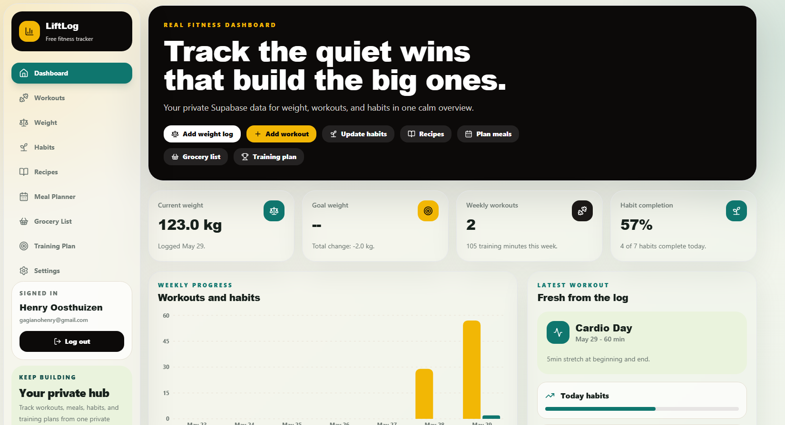
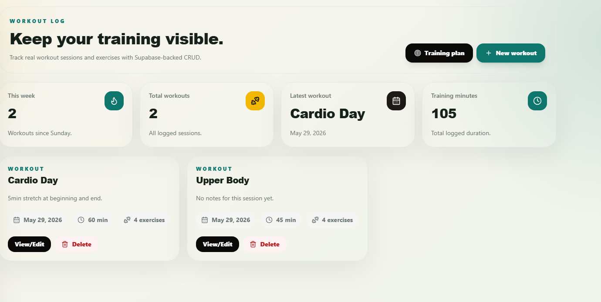
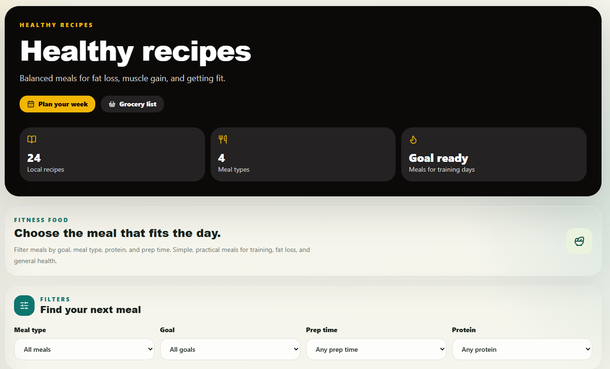
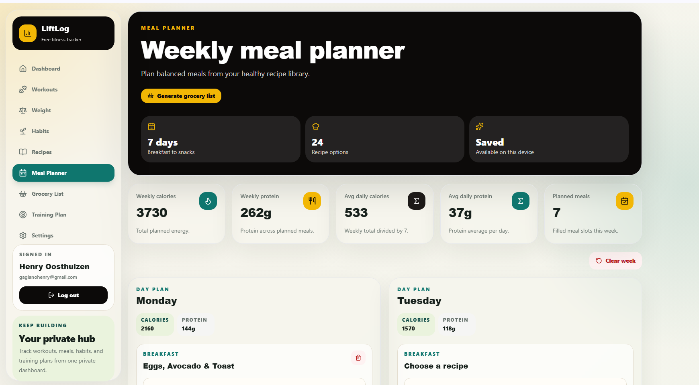
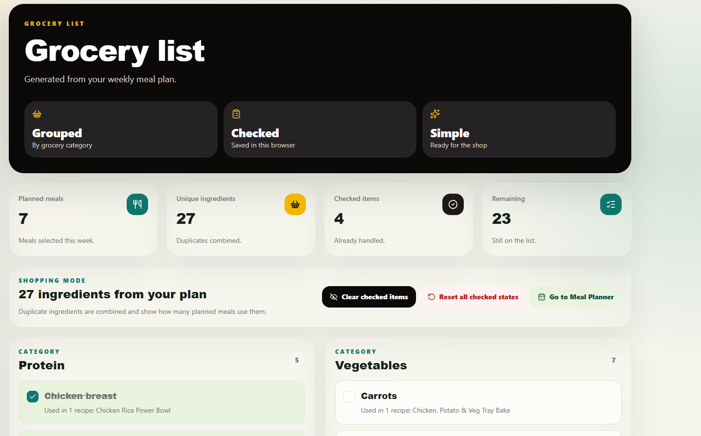
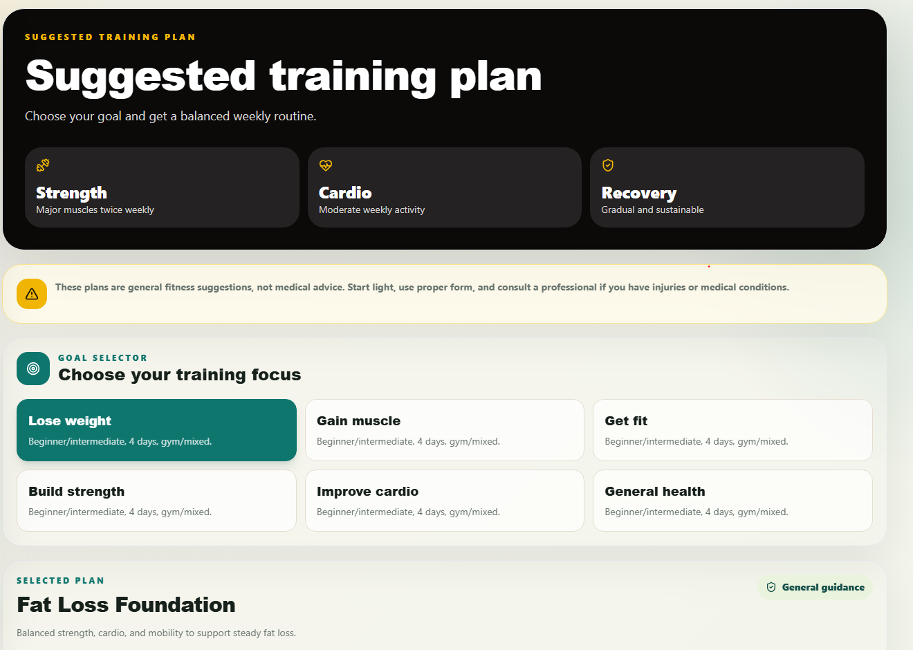
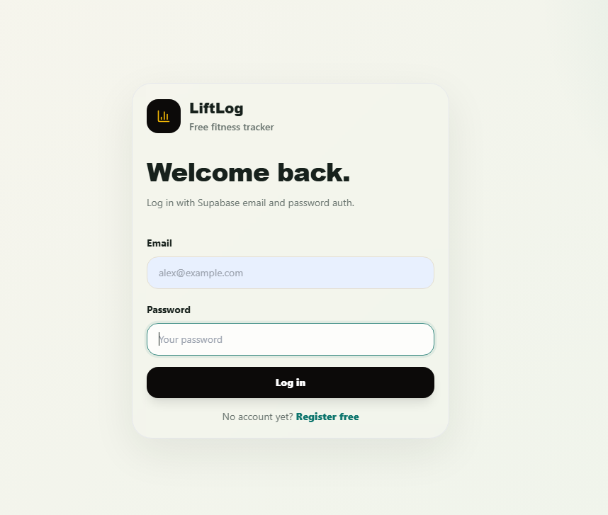
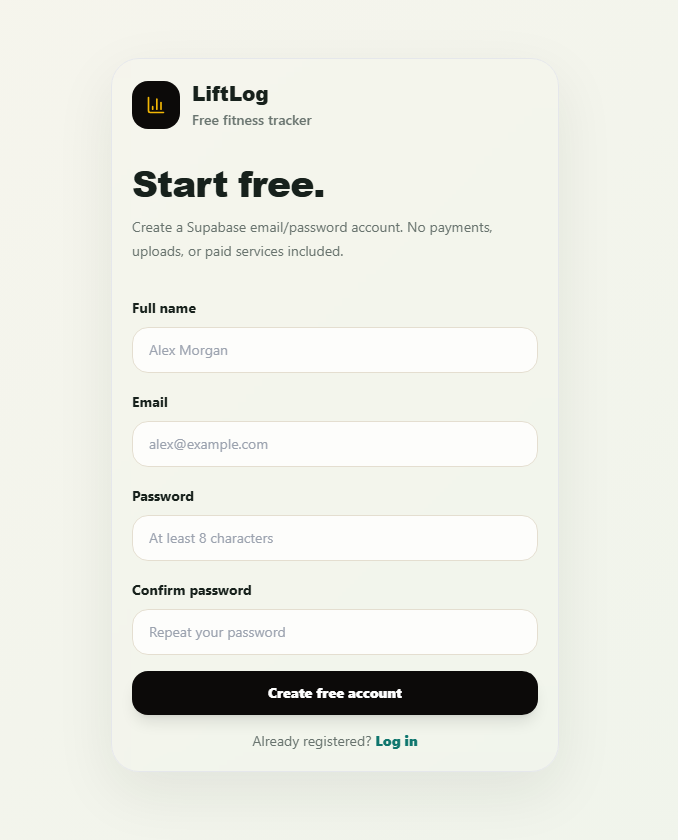

# LiftLog

LiftLog is a full-stack fitness tracker built with Next.js, Supabase, and
Tailwind CSS. It helps users track workouts, weight, habits, meals, groceries,
recipes, and suggested training plans in one clean dashboard.

Live demo: https://fitness.weblytics.co.za

Repository: https://github.com/HenryG-code/MyFitnessApp

## Screenshots

Portfolio screenshots are stored in `public/screenshots/`.

| Dashboard | Workouts |
| --- | --- |
|  |  |

| Recipes | Meal Planner |
| --- | --- |
|  |  |

| Grocery List | Training Plan |
| --- | --- |
|  |  |

| Login | Register |
| --- | --- |
|  |  |

Additional screenshot placeholders to capture later:

- `public/screenshots/weight.png`
- `public/screenshots/habits.png`
- `public/screenshots/settings.png`

Recommended capture flow:

1. Deploy the app or run it locally with `npm run dev`.
2. Log in with a demo Supabase account.
3. Seed a few safe demo entries for weight, habits, and workouts.
4. Capture each page at the same desktop width, then repeat a few mobile shots
   if desired.
5. Save screenshots with consistent lowercase kebab-case filenames.

Screenshot capture checklist:

- Use clean test data that looks realistic.
- Hide sensitive email addresses and personal account details where necessary.
- Capture `/dashboard`.
- Capture `/weight`.
- Capture `/habits`.
- Capture `/workouts`.
- Capture `/recipes`.
- Capture `/meal-planner`.
- Capture `/grocery-list`.
- Capture `/training-plan`.
- Capture `/settings`.

## Features

- Supabase email/password authentication.
- Protected dashboard and app routes.
- Real dashboard data from user-scoped Supabase records.
- Profile-backed goal weight shown in dashboard progress.
- Weight Tracker CRUD with stats and charting.
- Daily Habits tracking with boolean habit toggles.
- Workout Tracker CRUD with workout exercises.
- Healthy Recipes using static local TypeScript data.
- Meal Planner with browser `localStorage` persistence.
- Grocery List generated from planned meals with persistent checked state.
- Suggested Training Plans using static goal-based templates.
- Settings page with real profile data, privacy notes, logout, and quick links.
- External PayPal support link with Yoco marked as coming soon.
- Responsive desktop sidebar and mobile bottom navigation.
- Dark, screenshot-ready visual theme designed for comfortable longer use.
- Suggested Training Plan sessions can be logged directly into the workout log.
- PWA install support from supported desktop and mobile browsers.
- Opt-in notification preferences with a generic test notification.
- Mobile dashboard tools grid for Recipes, Meal Planner, Grocery List,
  Training Plan, Settings, and install guidance.

## Tech Stack

- Next.js App Router
- TypeScript
- Tailwind CSS
- Supabase Auth
- Supabase PostgreSQL
- Supabase Row Level Security
- Recharts
- Lucide React
- React Hook Form
- Zod
- Vercel

## Architecture Overview

LiftLog uses the Next.js App Router for public auth routes and protected app
routes. Shared UI lives in `components/`, while feature-specific query helpers,
types, static data, and browser-storage utilities live under `src/lib/`.

The app uses a browser Supabase client from `src/lib/supabase/client.ts`.
Supabase-backed features fetch only the signed-in user's rows and rely on Row
Level Security as the final protection layer.

Recipes and training plans are static local TypeScript data in v1. Meal Planner,
Grocery List, and the selected training goal use `localStorage` so the app stays
free-tier friendly without extra tables or services. No AI APIs, paid recipe
APIs, grocery APIs, payment SDKs, or scraping workflows are used.

## Database Overview

The Supabase schema is stored in `supabase/schema.sql`.

Core tables:

- `profiles`
- `weight_logs`
- `daily_habits`
- `workouts`
- `workout_exercises`

User-owned tables are scoped through Supabase Auth. RLS policies restrict rows
so users can only access their own fitness data. Workout exercises are protected
through their parent workout ownership.

Recipes and training plans are static local data in v1. Meal Planner and Grocery
List use browser storage in v1, so they do not require Supabase tables yet.

## Supabase Setup

1. Create a free Supabase project.
2. Enable Email authentication in Authentication > Providers.
3. Open the SQL Editor.
4. Copy the contents of `supabase/schema.sql`.
5. Run the SQL in Supabase.
6. Confirm RLS is enabled on the user-owned tables.
7. Add the local and production auth URLs listed in the Deployment section.

The schema creates tables, indexes, RLS policies, and a trigger that creates a
profile row when a new Supabase Auth user signs up.

If your existing Supabase project does not have profile goal weight support yet,
run this once in the Supabase SQL Editor:

```sql
alter table public.profiles
add column if not exists goal_weight_kg numeric(5, 2);

notify pgrst, 'reload schema';
```

## Environment Variables

Create `.env.local` locally and add:

```bash
NEXT_PUBLIC_SUPABASE_URL=
NEXT_PUBLIC_SUPABASE_ANON_KEY=
```

Use `.env.local` for local development, never commit it, and add the same
variables to the Vercel project settings for production.

## Local Development

Install dependencies:

```bash
npm install
```

Run the development server:

```bash
npm run dev
```

Create a production build:

```bash
npm run build
```

Open http://localhost:3000 while developing.

## Deployment

LiftLog is designed for Vercel Hobby hosting and Supabase Free.

Vercel steps:

1. Connect the GitHub repository to Vercel.
2. Add `NEXT_PUBLIC_SUPABASE_URL` and `NEXT_PUBLIC_SUPABASE_ANON_KEY` in Vercel
   Project Settings > Environment Variables.
3. Deploy from the main branch.
4. Add the custom domain `https://fitness.weblytics.co.za`.

Supabase Auth URL configuration:

Local URLs:

- `http://localhost:3000`
- `http://localhost:3000/auth/callback`
- `http://localhost:3000/dashboard`

Production URLs:

- `https://fitness.weblytics.co.za`
- `https://fitness.weblytics.co.za/auth/callback`
- `https://fitness.weblytics.co.za/dashboard`

Payment note: the Settings support card uses external links only. LiftLog does
not load PayPal or Yoco SDKs, process payments internally, collect card details,
store payment information, or run payment webhooks.

## PWA Install Support

LiftLog includes a web app manifest and install metadata so supported browsers
can install it without an app store. The Settings page includes an Install
LiftLog card with an `Install app` button where the browser exposes the install
prompt, plus manual instructions for browsers that do not.

- Android: Chrome menu > Install app or Add to Home Screen.
- iPhone: Safari > Share > Add to Home Screen.
- Desktop: use the browser address bar install icon or browser menu.
- Browser support varies, so manual instructions remain visible as a fallback.
- Notification preferences are available in Settings.
- Service worker caching is intentionally skipped for now to avoid stale private
  dashboard, workout, weight, or habit data.
- PWA icons live in `public/icons/` and can be replaced later with final brand
  assets if needed.

## Notifications

LiftLog includes opt-in notification preferences in Settings. Users can request
browser notification permission, choose reminder categories, set a preferred
time, disable reminders, and send a generic test notification.

- Preferences are stored on the device in v1.
- Browser and device support varies.
- Users can disable reminders anytime from Settings.
- Notification content avoids private workout, weight, habit, or meal details.
- This milestone supports permission handling and test notifications.
- Full background push reminders are future work.

## Manual QA Checklist

Use this checklist before demos or deployments:

1. Register and log in with a Supabase email/password user.
2. Confirm `/dashboard` loads real user-scoped data and handles empty states.
3. Test `/weight` add, edit, delete, chart, and stats.
4. Test `/habits` habit toggles and 7-day summary persistence.
5. Test `/workouts` create, edit, delete, exercise rows, and detail page.
6. Test `/recipes` filters and several `/recipes/[slug]` detail pages.
7. Test `/meal-planner` selections, refresh persistence, clear slot, and clear
   week.
8. Test `/grocery-list` generation, category grouping, checked persistence,
   clear checked, and reset checked.
9. Test `/training-plan` goal selection, refresh persistence, and Log workout
   links.
10. Test `/settings` profile data, notification preferences, PayPal support
    link, Yoco coming soon state, and logout.
11. Log out and confirm protected pages redirect to `/login`.

## Future Improvements

- Safe static asset service worker support.
- Background push reminders.
- Desktop app version with Tauri.
- Supabase persistence for Meal Planner, Grocery List, and training
  preferences.
- Custom training plan builder.
- More healthy recipes.
- Mobile app version later.

## Author

Built by Henry Gagiano as a full-stack fitness portfolio project.
